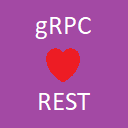

# MpSoft.AspNet.Grpc.MvcApiGenerator

### Description
MpSoft.AspNet.Grpc.MvcApiGenerator is source-generating library generating ASP.NET MVC API controllers for the gRPC services in design time.

### Purpose
The gRPC is great for inter-services data communication. However, it's designed for modern technologies (namely HTTP/2) and its usage might break the service availability for legacy systems. This package brings the fallback feature to be available for REST clients.  
Please note, runtime generator based on runtime type system is available on https://www.nuget.org/packages/MpSoft.AspNet.Grpc.MvcApi.

### Features
* Generates MVC API controller for the gRPC service's methods in design time.
* Allows to customize the generated controller
* Allows to reference the generated controller type from other code

### Installation and Documentation
[See](./Documentation.md)

### Release notes
[See](./ReleaseNotes.md)
